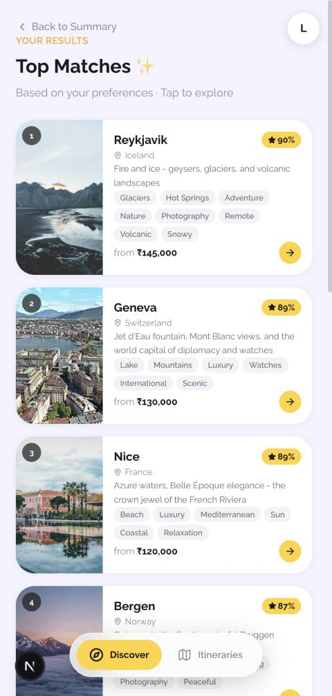
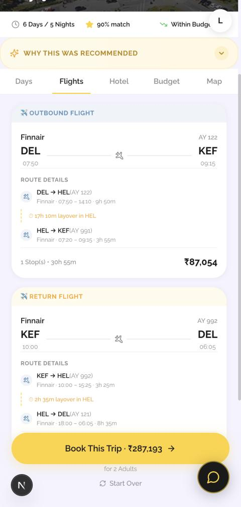
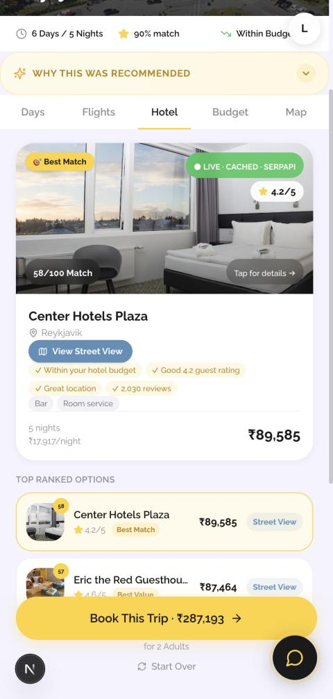
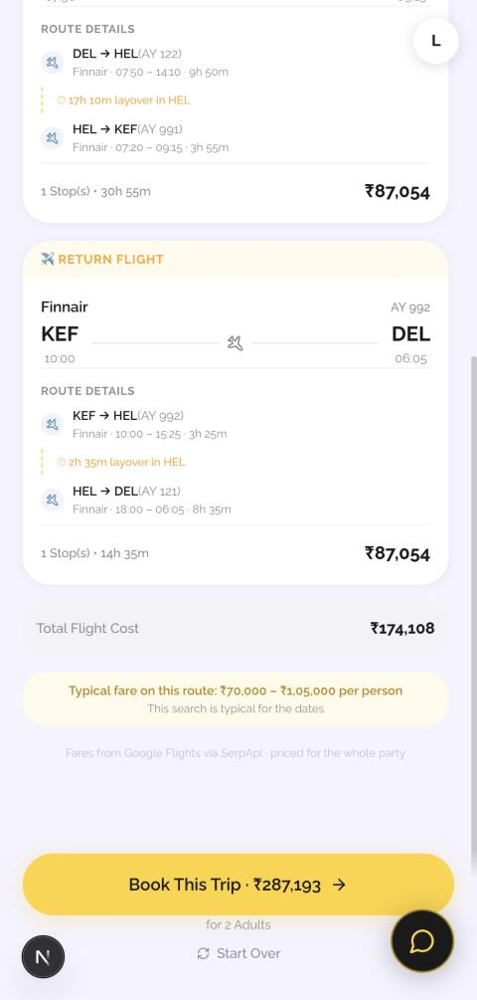
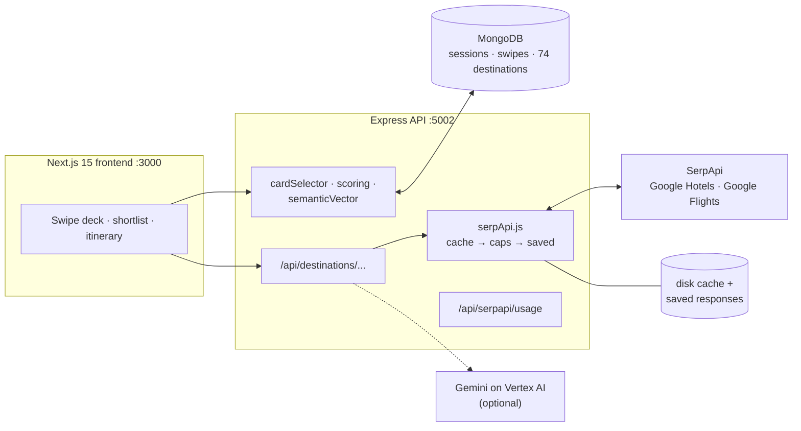

<div align="center">

# TravelBuddy

**Swipe on travel photos. Get a trip with real flights and a real hotel — priced live from Google.**

<sub>SerpApi India Hackathon 2026 · Travel & Local Discovery</sub>

<br />

<table>
<tr>
<td width="25%" align="center"><br/><sub>Destinations ranked from your swipes</sub></td>
<td width="25%" align="center"><br/><sub>Real flights, layovers and total fare</sub></td>
<td width="25%" align="center"><br/><sub>A hotel picked from live Google Hotels rates</sub></td>
<td width="25%" align="center"><br/><sub>Is this fare good? Google's typical range</sub></td>
</tr>
</table>

</div>

---

## The idea

Booking sites ask you to type a destination and some dates. Most people don't
have either yet — they have a feeling: _sea, quiet, good food, not too
expensive_.

TravelBuddy never asks for a destination. You swipe through travel photos
(vibes, activities, stays). A small recommendation engine turns the swipes into
a taste profile, ranks 74 European destinations against it, and for the one you
open it asks **Google Flights and Google Hotels, through SerpApi,** what the
trip would actually cost for your dates, your party and your home airport:

- the cheapest **sensible** flight pair — not just the cheapest fare, but the
  one that weighs price against hours spent travelling,
- the **hotel** that best fits your swipes, price and Google's own ratings,
- a **budget** that adds it all up against what you said you could spend.

Every flight and hotel on those tabs comes from a SerpApi search, and the
screen says whether it was fetched just now, served from cache, or is a saved
example.

## How it uses SerpApi

SerpApi is the source of all flight and hotel data. The booking API this app
was originally built on is gone, and these two engines replaced it:

| Engine                                | What we ask for                                                                                               | What we use from the response                                                                                                                                                          |
| ------------------------------------- | ------------------------------------------------------------------------------------------------------------- | -------------------------------------------------------------------------------------------------------------------------------------------------------------------------------------- |
| **Google Hotels** (`google_hotels`)   | The destination city, the trip's check-in and check-out dates, 2 adults per room, `currency=INR`, `gl=in`     | Up to 20 properties: nightly rate and total rate, star class, guest rating and review count, Google's `location_rating`, amenities, photos, GPS, check-in times                        |
| **Google Flights** (`google_flights`) | Outbound search from the guest's home airport, then the return leg with the chosen option's `departure_token` | Best and other flights, each with real legs, airlines, flight numbers, layover durations and total duration, plus `price_insights` (typical price range and whether the date is cheap) |

**One destination costs three searches** (hotels, outbound flights, return
flights). The engine around them is the interesting part:

```
Google Flights results ──► keep the 5 cheapest and the 4 fastest options
                       ──► score = fare + hours travelled × ₹2,000
                       ──► choose the outbound, then fetch its matching return
```

So a 37-hour itinerary that saves ₹3,000 loses to a 22-hour one. For hotels the rank blends **swipe fit (35%)**, price against the trip's
budget (25%), guest rating (20%), Google's location rating (10%) and review
volume (10%), and tags the winners _Best Match_, _Best Value_ and _Highly
Rated_. The UI shows _why_ a hotel was chosen.

Flight fares from Google are for the whole round trip; the app searches for one
adult and multiplies by the party size (checked against a two-adult search,
which returns exactly twice the fare), and prices hotels per room.

### Spending credits carefully

The SerpApi free plan is 250 searches a month, so every search passes through
three layers before it can cost a credit — see
[`server/src/lib/serpApi.js`](travelbuddy/server/src/lib/serpApi.js):

1. **A 48-hour cache, saved to disk.** Opening the same destination again, or
   restarting the server, costs nothing.
2. **Daily and monthly caps** (`SERPAPI_DAILY_CAP`, `SERPAPI_MONTHLY_CAP`,
   defaults 40 and 230, counted on the Indian calendar day). When a cap is hit
   the app does not fail; it falls through to layer 3.
3. **Demo Mode.** Real SerpApi responses for eight popular routes from Delhi
   are saved in [`server/src/data/serp-snapshots.json`](travelbuddy/server/src/data/serp-snapshots.json)
   (captured by `npm run capture`). With no key at all the app still shows real
   Google data, and says **SAVED EXAMPLE** instead of **LIVE**.

Every hotel and flight carries its `provenance` (`live`, `cached` or `saved`)
and `fetchedAt`, and the itinerary shows it. A saved response is never passed
off as live. `GET /api/serpapi/usage` reports the credits spent.

## The rest of the product

TravelBuddy is a complete trip-planning flow, not just a search wrapper:

- **Swipe engine.** 66 cards across three phases. Each card carries semantic
  tags with MiniLM embeddings (768 dimensions). Swipes feed a leaky-integrator
  preference vector with IDF weighting, so a rare tag like _adrenaline_ counts
  for more than _sunny_, and later swipes outweigh earlier ones.
- **Adaptive feed.** An epsilon-greedy card selector (75% close to your taste,
  25% exploration) with a diversity interleaver, "Duel" cards when your swipes
  contradict each other, and a "Preferences converged!" prompt that lets you
  stop early.
- **Destination ranking.** Cosine similarity of your three vectors
  (vibes 50%, activities 30%, stays 20%) against 74 seeded destinations, with
  a budget adjustment. Only destinations with a flight route are shortlisted.
- **Itinerary view.** Days, Flights, Hotel, Budget and Map tabs; a booking-style
  PDF; a travel chatbot.
- **Details.** [`PRODUCT_SUMMARY_AND_FEATURES.md`](travelbuddy/PRODUCT_SUMMARY_AND_FEATURES.md),
  [`ML_ARCHITECTURE.md`](travelbuddy/ML_ARCHITECTURE.md).

## Architecture



| Layer              | Choice                                                          |
| ------------------ | --------------------------------------------------------------- |
| Frontend           | Next.js 15, React 19, Tailwind v4, Framer Motion, NextAuth      |
| API                | Express 4, Mongoose 8                                           |
| Hotels and flights | **SerpApi** — Google Hotels and Google Flights                  |
| Preference engine  | MiniLM tag embeddings, leaky integrator, IDF, cosine similarity |
| Optional AI        | Gemini through Vertex AI (day-plan text, chat, photo analysis)  |

## Run it locally

You need Node 20+ and MongoDB (`mongod` locally, Docker, or a free Atlas URI).

```bash
git clone <this repository>
cd <repository>/travelbuddy

# 1. API
cd server
npm install
cp .env.example .env            # add SERPAPI_API_KEY (optional, see below)
npm run seed                    # loads 66 cards and 74 destinations
npm start                       # http://localhost:5002

# 2. Frontend, in a second terminal
cd <repository>/travelbuddy/travel-buddy
npm install
cp .env.local.example .env.local   # set AUTH_SECRET:  openssl rand -base64 32
npm run dev                        # http://localhost:3000
```

`npm run check` in `server/` tells you whether MongoDB, your SerpApi key and
the saved responses are all in order. `npm test` runs the unit tests for the
flight picker, hotel ranker and photo resizer (no network, no credits).

Walk through it: choose a departure city and dates, swipe, and at **Find My
Destinations** create a local account (email and password, stored in your own
MongoDB). Open any of the top matches and look at the **Flights** and **Hotel**
tabs.

**One key is enough.** With only `SERPAPI_API_KEY` set, hotels and flights are
live. With **no key** the app runs in Demo Mode on the saved responses (Delhi
to Reykjavik, Copenhagen, Vienna, Rome, Brussels, Athens, Prague and Lisbon).
A route with no saved response falls back to the app's built-in sample prices,
which carry no SerpApi label.

To refresh the saved responses from real searches (costs 3 credits per route):

```bash
cd travelbuddy/server && npm run capture
```

| Variable                                                 | Where                     | Needed for                                       |
| -------------------------------------------------------- | ------------------------- | ------------------------------------------------ |
| `SERPAPI_API_KEY`                                        | `server/.env`             | Live hotels and flights                          |
| `SERPAPI_DAILY_CAP`, `SERPAPI_MONTHLY_CAP`               | `server/.env`             | Credit caps (defaults 40 / 230)                  |
| `MONGODB_URI`                                            | `server/.env`             | Sessions, swipes, destinations, accounts         |
| `VERTEX_API_KEY`, `VERTEX_PROJECT_ID`, `VERTEX_LOCATION` | `server/.env`             | Optional. AI day-plan text, chat, photo analysis |
| `NEXT_PUBLIC_API_URL`                                    | `travel-buddy/.env.local` | Where the frontend finds the API                 |
| `AUTH_SECRET`, `AUTH_URL`                                | `travel-buddy/.env.local` | NextAuth (required)                              |
| `GOOGLE_CLIENT_ID`, `GOOGLE_CLIENT_SECRET`               | `travel-buddy/.env.local` | Optional "Continue with Google"                  |

Secrets live only in `.env` files, which git ignores.

## What was built for this hackathon

TravelBuddy existed before this hackathon: the swipe engine, the ranking, the
itinerary UI and the server were built for an earlier travel-API hackathon, and
hotels and flights came from a travel-industry booking API. That integration
has been removed completely.

**Everything SerpApi was built for this event** and is easy to review:
commits are prefixed `serpapi:`, and the tag
[`pre-serpapi`](../../compare/pre-serpapi...main) marks the original code as
received, so that compare view is the full diff. In short:

- `server/src/lib/serpApi.js`: the SerpApi client, the flight picker, the hotel
  ranker, the cache, the credit budget and Demo Mode. It replaces the old
  `hotelApi.js` and keeps the same four exports, so the routes and the UI
  needed little change.
- `server/src/routes/destination.js` and the itinerary UI: provenance labels,
  Google's typical-fare insight, layover details, and shortlisting by flight
  availability.
- Snapshot capture, usage endpoint and health check scripts.

## Honest status

- ✅ **Live:** hotel rates and photos, flight fares, layovers and typical-price
  insight, from SerpApi, for any of the 74 destinations that has an airport.
- ✅ **Works without a key:** Demo Mode serves real saved responses for eight
  routes and labels them as saved.
- ⚠️ **Nothing is actually booked.** The payment gateway and the "TravelCash"
  rewards are a simulation, as they were in the original app.
- ⚠️ **Gemini is optional and off by default** because it needs Google Cloud
  (Vertex AI) credentials. Without them, day-by-day text uses the built-in
  plan for each destination; hotels, flights and prices are unaffected.
- ⚠️ **Transfers and activity prices** on the budget tab are estimates, not
  quotes. Only flights and hotels are live.
- ⚠️ Free-plan limits apply: 250 searches a month.

## AI assistance

The SerpApi migration (code, checks against live responses, and docs) was
developed with Claude Code from Anthropic. The product's own optional AI
features use Gemini on Vertex AI.

## Team

Maintained by Team AlphaForge. See the repository's contributors for who wrote
what.

<!-- Add every teammate's real name and GitHub handle here before submitting. -->
